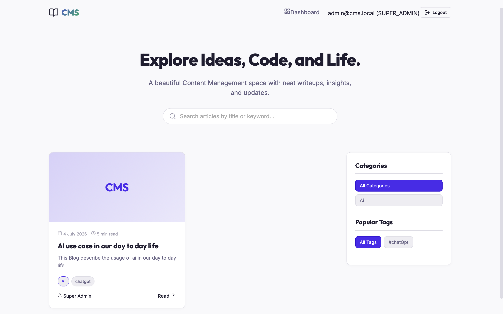
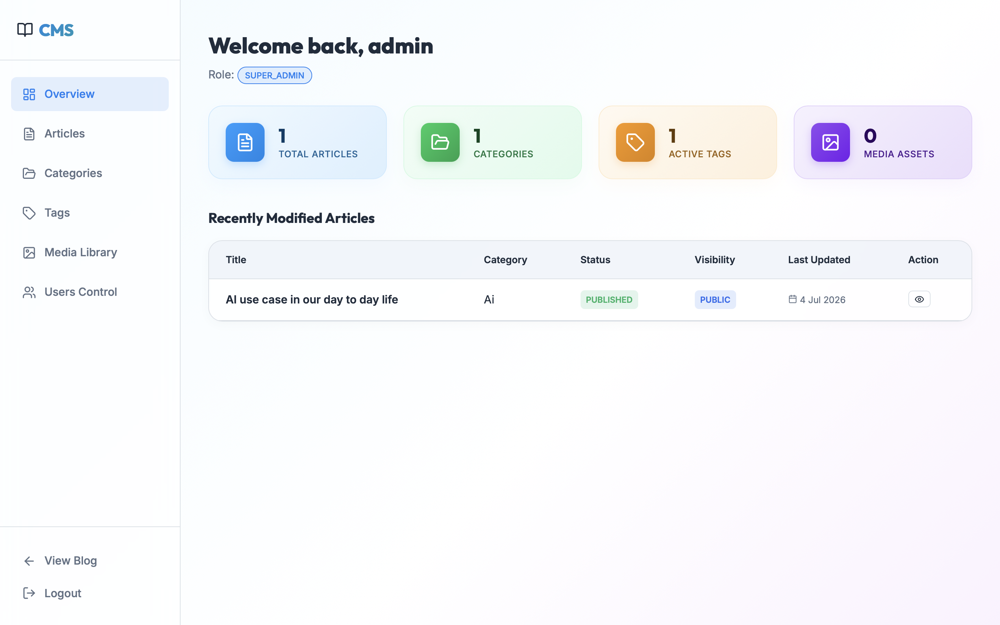
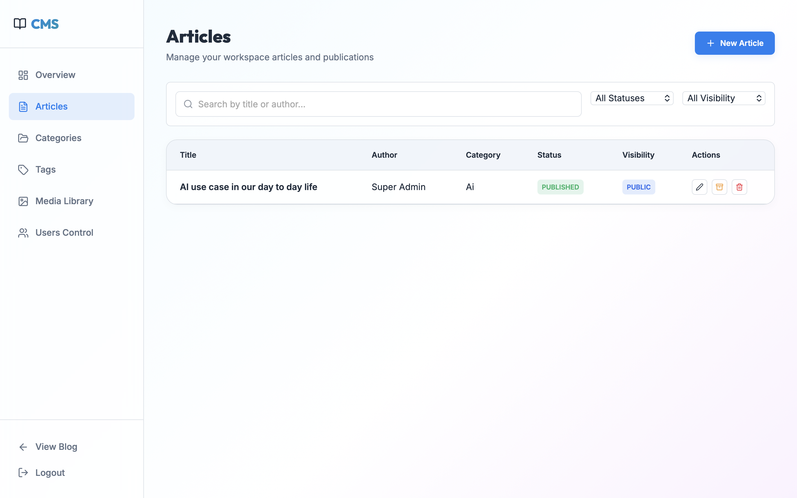
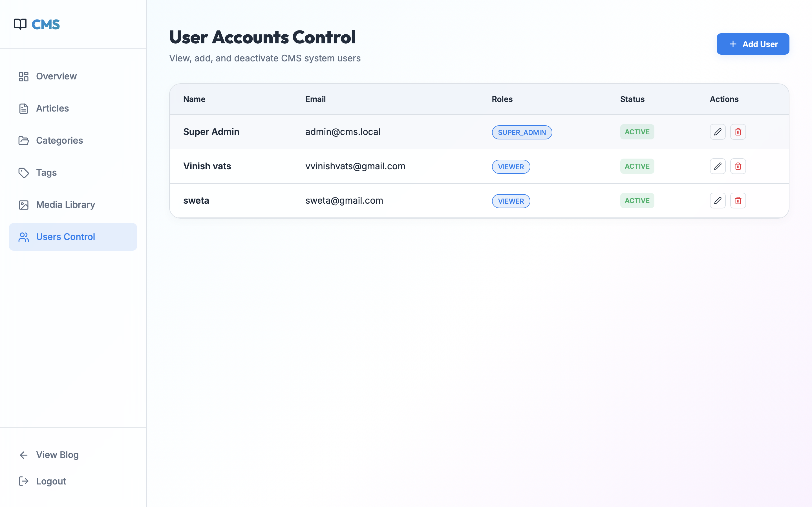

# CMS Backend + Frontend

A production-style Content Management System built with Spring Boot on the backend and React + Vite on the frontend. It supports public article browsing and a role-based admin dashboard for managing articles, categories, tags, media, and users.

## Access Live Link
- Live Link :- https://idea-flow-mocha.vercel.app


## Features

- Public blog homepage with search, category filtering, and tag filtering.
- Article detail pages with published content and metadata.
- Authentication with JWT-based login and role-aware access control.
- Dashboard views for overview stats, article management, category management, tag management, media library, and user control.
- Seeded Super Admin account created on startup if it does not already exist.

## Tech Stack

- Backend: Java 21, Spring Boot 3.5.4, Spring Security, Spring Data JPA, JWT, MapStruct, PostgreSQL
- Frontend: React 19, Vite, React Router, Lucide icons
- Dev database: H2

## Project Structure

- `src/main/java` - Spring Boot application source
- `src/main/resources` - application config and database migration resources
- `cms-frontend` - React frontend application

## Prerequisites

- Java 21
- Node.js 18+ and npm
- PostgreSQL for production

## Run Locally

### Backend

```bash
./mvnw spring-boot:run
```

### Frontend

```bash
cd cms-frontend
npm install
npm run dev
```

## Production Environment Variables

The backend production profile expects these values:

- `DB_URL`
- `DB_USERNAME`
- `DB_PASSWORD`
- `JWT_SECRET_KEY`
- `JWT_ACCESS_TOKEN_EXPIRATION` optional
- `JWT_REFRESH_TOKEN_EXPIRATION` optional

The bootstrap admin account can also be overridden with `cms.bootstrap` properties.

## Default Admin Login

Unless your deployment overrides bootstrap values, the seeded admin account is:

- Email: `admin@cms.local`
- Password: `Admin@1234`

## Screenshots

The screenshots below show the main CMS experience across public and admin views.

### Public Homepage



A clean landing page for visitors to browse articles, filter by category or tag, and open article details.

### Dashboard Overview



A summary screen with article, category, tag, and media stats plus the latest updated article.

### Articles Management



A table-based admin page for searching, filtering, publishing, archiving, editing, and deleting articles.

### User Accounts Control



An admin panel for viewing system users, their roles, and account status.

## Notes

- Production mode uses `spring.profiles.active=prod` and reads the database/JWT settings from environment variables.
- The app seeds permissions, roles, and a Super Admin user on startup if they are missing.

## Architecture Notes for Interview

This project can be presented as a read-heavy content platform, where article browsing, filtering, and discovery are the dominant user flows.

### Data Modeling

- `User` has a one-to-many relationship with `Article` through the author field.
- `Article` belongs to one `Category` and can have many `Tags`.
- `Category` groups many articles, while `Tags` are modeled for flexible many-to-many style filtering.

### Search Strategy

- For the current scale, article filtering and search can be handled through API queries and frontend filtering.
- At larger scale, the search bar should move to full-text search with proper indexing or a search engine such as Elasticsearch or Algolia.

### Read-Heavy Optimization

- Use Redis caching for frequently accessed data such as homepage article lists, popular tags, categories, and dashboard counters.
- Cache article detail responses for published content to reduce repeated database reads.

### Pagination Strategy

- Use page-based pagination for admin tables and moderate lists.
- Use cursor-based pagination for very large public feeds because it scales better than offset-based queries.

### Media Storage

- Store uploaded images and files in object storage such as AWS S3 or Cloudinary.
- Keep only URLs and metadata in the database instead of storing binary files directly.

### Security and RBAC

- Authentication uses JWT.
- Authorization is enforced with Spring Security and role-based guards such as `SUPER_ADMIN`, `ADMIN`, `EDITOR`, `AUTHOR`, and `VIEWER`.
- Sensitive endpoints are protected so a low-privilege user cannot call admin APIs directly from tools like Postman.

### Scaling Plan

- Add database indexes on article title, tags, and category fields.
- Use Redis for hot data and repeated dashboard reads.
- Serve frontend assets and uploaded media through a CDN.
- Introduce read replicas so read traffic can be separated from write traffic.

### Testing Strategy

- Unit tests should cover smaller functions such as password hashing and token generation.
- Integration tests should validate API routes, status codes, and authorization failures.
- Load tests should check behaviour under concurrent traffic.
- End-to-end tests should verify the main browser flow from login to content management.